# AsiActionEngine 动作状态机系统设计分析

---

## 📋 系统概述

AsiActionEngine 是一个基于多层级动画状态机的商业级角色控制系统，主要用于处理复杂的角色动作、战斗、交互等行为。该系统采用了分层并行执行的设计思路，能够同时管理多个动画层级的状态转换。

---

## 🎯 核心设计理念

### 1. 分层并行架构
- **多层级同时运行**：不同动画层可以并行执行不同的动作
- **层级独立性**：每个层级有独立的状态机和事件系统
- **层级协调**：通过统一的管理器协调各层级的行为

### 2. 事件驱动模式
- **时间轴事件**：基于精确时间点触发的事件系统
- **状态转换事件**：通过条件检查触发的状态切换
- **生命周期管理**：完整的事件进入、更新、退出流程

### 3. 对象池优化
- **内存管理**：避免频繁的对象创建和销毁
- **性能优化**：通过对象复用提升运行效率
- **继承机制**：事件在状态切换时的数据继承

---

## 🏗️ 核心组件分析

### ActionStateMachine（主状态机）

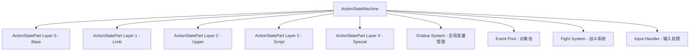

**ActionStateMachine 是整个系统的核心控制器，负责：**
- 管理5个并行的 ActionStatePart 层级
- 协调各层级之间的通信
- 处理全局输入和事件分发
- 管理对象池和内存优化
- 提供统一的外部接口

### ActionStatePart（状态执行部分）

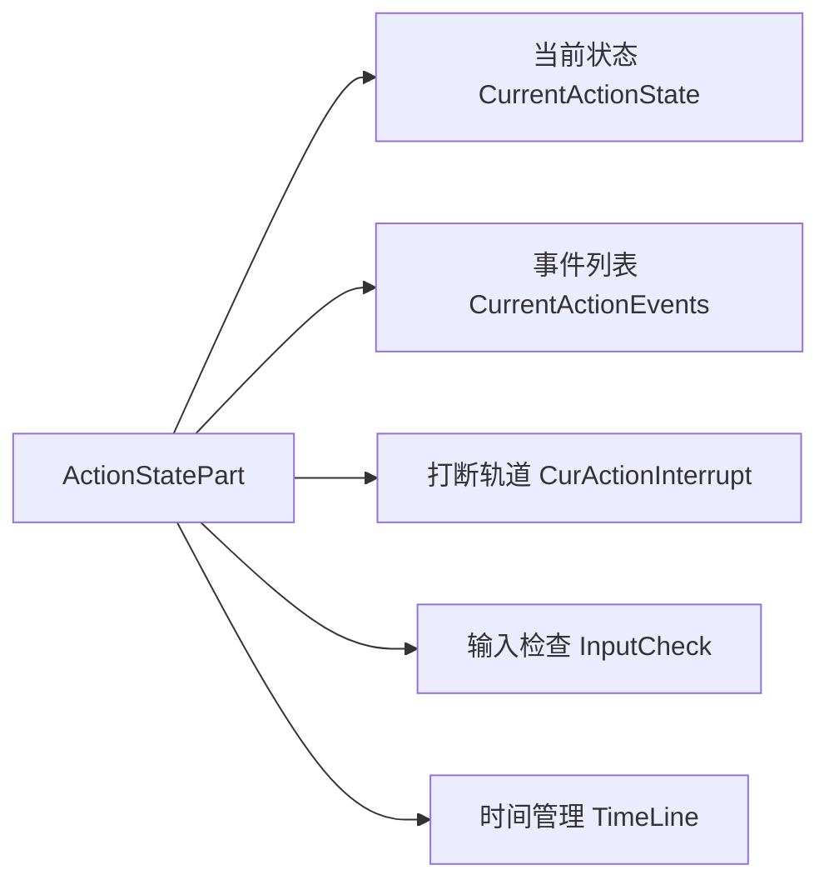

**ActionStatePart 代表一个动画层级的状态执行器：**

#### 为什么叫 "Part"？
- **部分执行器**：它只负责整个角色行为的"一部分"（一个层级）
- **模块化设计**：每个 Part 都是独立的模块，可以单独运行
- **组合完整性**：多个 Part 组合起来形成完整的角色行为

#### ActionStatePart 实际指向什么？
```csharp
// ActionStatePart 实际上是一个特定动画层级的状态机实例
// 每个 Part 对应 Animator 中的一个 Layer
ActionStatePart basePart = allActionStatePart[0];    // 对应 Animator Layer 0
ActionStatePart limbPart = allActionStatePart[1];    // 对应 Animator Layer 1
ActionStatePart upperPart = allActionStatePart[2];   // 对应 Animator Layer 2
```

### 系统层级结构

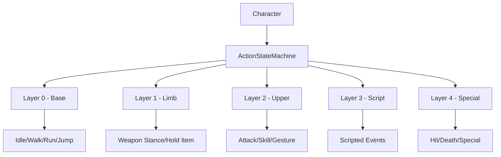

**各层级的职责分工：**
- **Layer 0 (Base)**：全身基础动作（移动、待机）
- **Layer 1 (Limb)**：肢体状态（持武器姿态、装备状态）
- **Layer 2 (Upper)**：上半身动作（攻击、技能、手势）
- **Layer 3 (Script)**：脚本控制的特殊行为
- **Layer 4 (Special)**：覆盖性动作（受击、死亡）

---

## ⚙️ 核心工作流程

### 状态切换流程

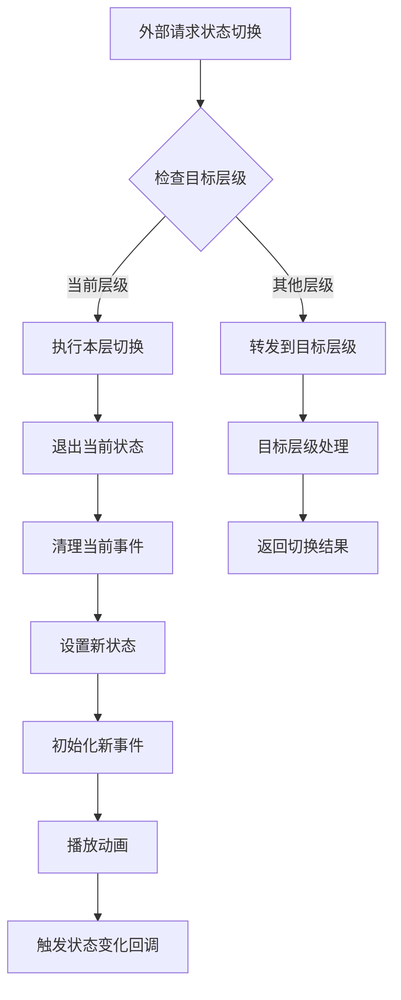

### 每帧更新流程

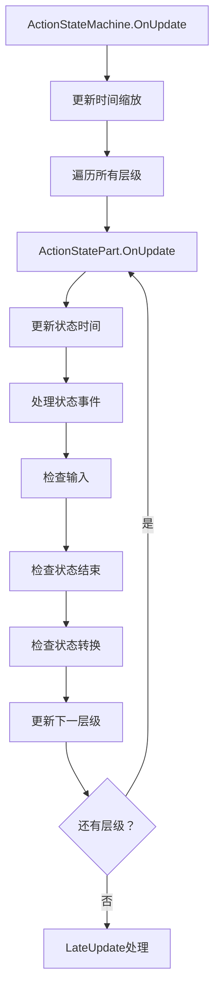

### 事件系统流程

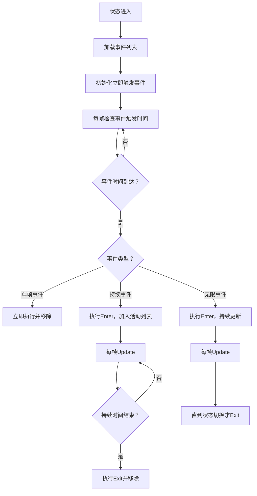

### 事件继承机制

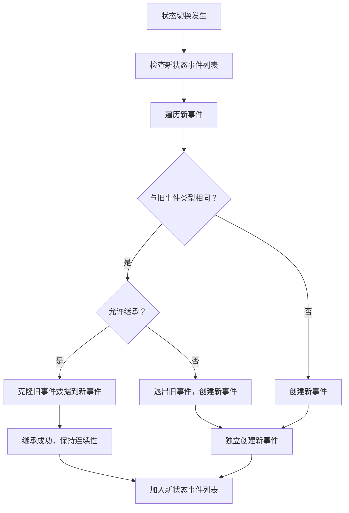

---

## 🎮 输入处理机制

### 输入类型分类

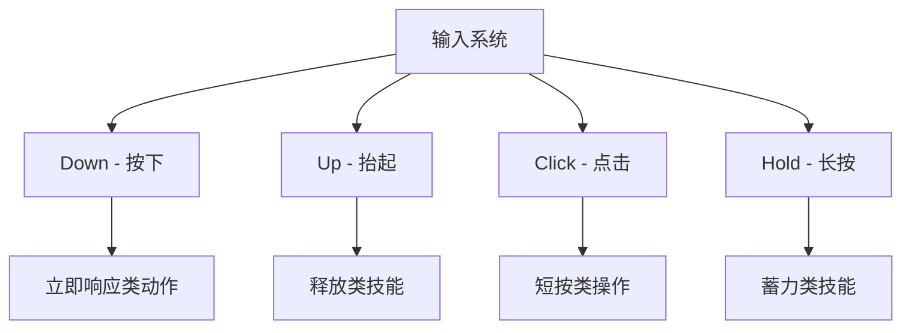

### 预输入系统

系统支持预输入机制，允许在动作执行过程中提前输入下一个动作：

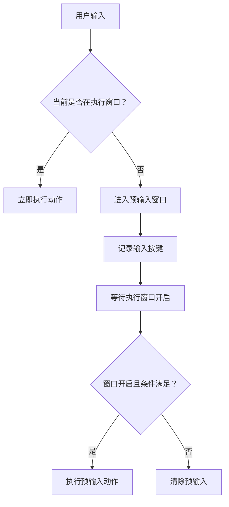

---

## ⚔️ 战斗系统集成

### 受击处理流程

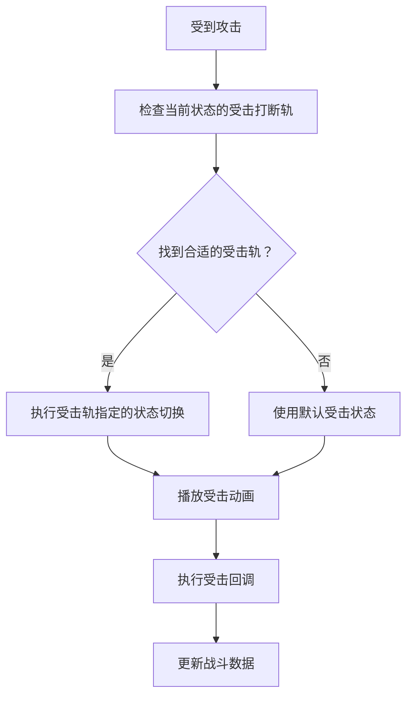

### 命中处理流程

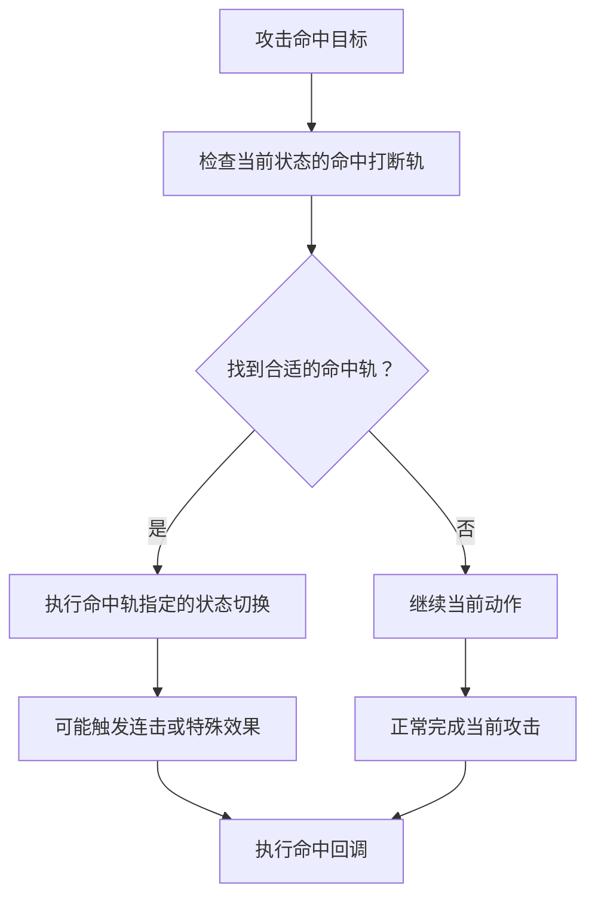

---

## 🏊 对象池设计

### 事件对象池

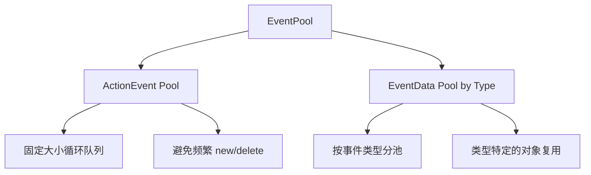

### 为什么需要对象池？

1. **性能考虑**：角色动作切换频繁，事件创建销毁开销大
2. **内存管理**：避免GC压力，特别是移动端
3. **数据继承**：事件切换时需要保持某些数据的连续性

---

## 🔧 GValue 全局变量系统

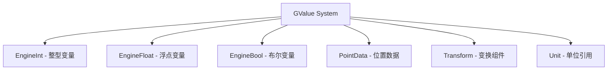

**GValue 系统用于：**
- 状态机之间的数据共享
- 条件判断的参数来源
- 动态配置的数据存储
- 跨状态的数据传递

---

## 🔌 扩展系统

### 组件获取机制

```csharp
// 高效的组件缓存机制
public bool TryGetComponent<T>(out T component) where T : Component
{
    // 1. 检查缓存字典
    // 2. 如果没有则尝试获取
    // 3. 缓存结果避免重复获取
    // 4. 支持调试信息输出
}
```

### 逻辑扩展系统

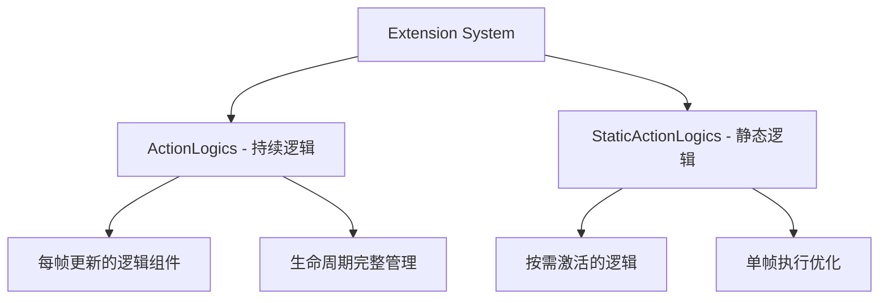

---

## 🌟 系统优势

### 1. 高度模块化
- 每个组件职责单一
- 易于扩展和维护
- 支持热插拔式功能添加

### 2. 性能优化
- 对象池减少内存分配
- 分层更新降低计算复杂度
- 缓存机制提升访问效率

### 3. 灵活配置
- 数据驱动的状态定义
- 可视化的编辑器支持
- 运行时动态调整能力

### 4. 战斗集成
- 完整的受击/命中处理
- 灵活的打断机制
- 多层级并行战斗动作

---

## 📝 总结

AsiActionEngine 通过分层状态机、事件驱动、对象池优化等设计，构建了一个功能强大且性能优秀的角色控制系统。其核心思想是将复杂的角色行为分解为多个并行的简单状态机，每个状态机负责特定层级的动画控制，通过统一的管理器进行协调，最终实现复杂而流畅的角色表现。

这种设计特别适合需要复杂动作组合的游戏类型，如动作游戏、格斗游戏、MMORPG等，能够支持同时进行的多种动作（如边走边攻击、上半身技能+下半身移动等）。

---

## 🎯 设计启发

通过分析 AsiActionEngine 的设计，我们可以提取以下关键设计模式：

1. **分层架构模式**：将复杂系统分解为多个独立但协调的层级
2. **事件驱动模式**：通过事件系统解耦各个组件
3. **对象池模式**：优化内存使用和性能
4. **状态机模式**：清晰地管理状态转换
5. **组合模式**：通过组合多个简单组件实现复杂功能

这些模式的组合使用，是构建大型游戏系统的重要参考。