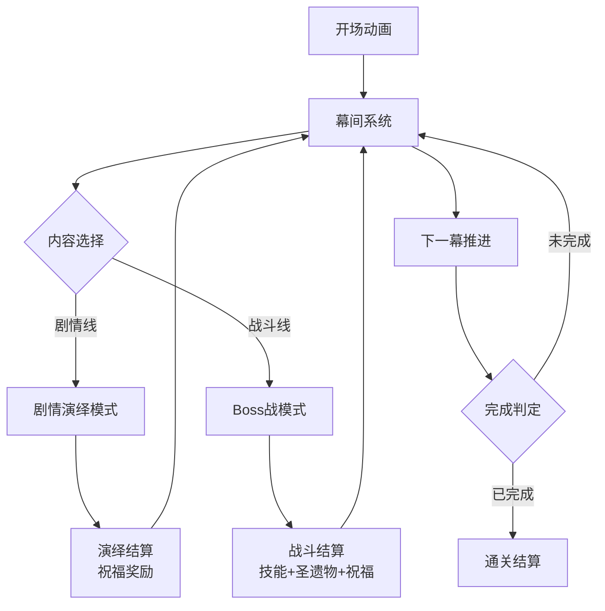
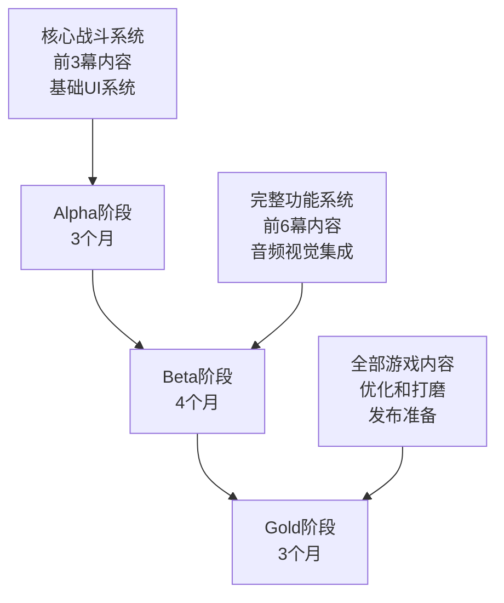

# 命运：圣杯之塔 - 游戏设计文档

**版本：** 3.3  
**项目代号：** Fate Knight Of Rounds  
**类型：** JRPG + Roguelite元素

---

## 1. 游戏核心概述

### 1.1 核心玩法
玩家扮演亚瑟在圣杯之塔中重历传奇，通过**剧情演绎**和**Boss战**推进，获得**祝福、技能、圣遗物**构筑战斗流派，体验深度的战略构筑乐趣。

### 1.2 游戏流程架构



### 1.3 核心机制矩阵

| 系统模块 | 核心功能 | 获取途径 | 使用限制 |
|---------|---------|---------|---------|
| **祝福系统** | 战略构筑核心，提供多样化能力增强 | 每次结算随机获得3个 | 有携带上限，幕间配置 |
| **技能系统** | 主动战斗技能，丰富战术选择 | 击败特定Boss获得 | 最多装备2个，可替换 |
| **圣遗物系统** | 永久被动效果，影响必杀技威力 | Boss战必定掉落 | 获得即永久携带 |
| **援助系统** | 条件触发支援，增加战术深度 | 特定Boss解锁 | 最多4个，可配置触发条件 |

---

## 2. 属性与战斗系统

### 2.1 角色属性体系

#### 2.1.1 属性分类结构

```
角色属性架构
├── 基础属性
│   ├── 攻击系统 (攻击力、暴击率、暴击伤害、攻击速度)
│   ├── 生存系统 (生命值、魔力值、防御力、韧性)
│   └── 机动系统 (移动速度、魔力回复速度)
├── 额外属性
│   ├── 数值增加 (直接增加点数)
│   ├── 百分比加成 (按比例增强)
│   └── 特殊抗性 (减少特定伤害)
├── 状态属性
│   └── 当前数值 (实时生命、魔力、韧性)
└── 计算属性
    └── 最终战斗数值 (结合所有加成后的实际数值)
```

#### 2.1.2 基础属性详解

**攻击相关属性**
- **基础攻击力 (bATK)**: 角色的基础物理输出能力
- **基础暴击率 (bCrt)**: 造成暴击的基础概率
- **基础暴击伤害 (bCrtDamage)**: 暴击时的额外伤害倍数
- **基础攻击速度 (bATKSpeed)**: 攻击动作的执行速度

**生存相关属性**
- **最大基础生命值 (bMaxHp)**: 角色的基础生命上限
- **最大基础魔力值 (bMaxMp)**: 角色的基础魔力上限
- **基础防御力 (bDp)**: 减少受到伤害的基础能力
- **韧性值**: 角色抗击倒的能力，归零时会被击飞

**机动相关属性**
- **基础移动速度 (bSpeed)**: 角色的基础移动速度
- **魔力基础回复速度 (bMpRecoverSpeed)**: 魔力的基础恢复速率

#### 2.1.3 额外属性系统

**数值增加类**
- **额外攻击力 (exATK)**: 直接增加的攻击力点数
- **额外最大生命值 (exMaxHp)**: 直接增加的生命值点数
- **额外最大魔力值 (exMaxMp)**: 直接增加的魔力值点数
- **额外防御力 (exDp)**: 直接增加的防御力点数
- **额外暴击率 (exCrt)**: 直接增加的暴击概率
- **额外暴击伤害 (exCrtDamage)**: 直接增加的暴击伤害

**百分比加成类**
- **攻击力加成 (ATKAdd)**: 按比例增强最终攻击力
- **最大生命值加成 (MaxHpAdd)**: 按比例增强最大生命值
- **最大魔力值加成 (MaxMpAdd)**: 按比例增强最大魔力值
- **防御力加成 (DpAdd)**: 按比例增强防御力
- **移动速度加成 (SpeedAdd)**: 按比例增强移动速度
- **攻击速度加成 (ATKSpeedAdd)**: 按比例增强攻击速度
- **魔力回复速度加成 (MpRecoverSpeedAdd)**: 按比例增强魔力回复

**伤害类型加成**
- **普攻伤害加成 (CommonATKAdd)**: 专门增强普通攻击伤害
- **技能伤害加成 (SkillAdd)**: 专门增强技能伤害
- **必杀伤害加成 (ExcarliburAdd)**: 专门增强必杀技伤害
- **通用伤害加成 (UniversalDamageAdd)**: 增强所有类型伤害
- **灼烧伤害加成 (FireDamageAdd)**: 专门增强火属性持续伤害

**抗性系统**
- **普攻耐受率**: 减少普通攻击造成的伤害 (0-100%)
- **技能耐受率**: 减少技能攻击造成的伤害 (0-100%)
- **必杀耐受率**: 减少必杀技造成的伤害 (0-100%)
- **灼烧耐受率**: 减少火属性持续伤害 (0-100%)

#### 2.1.4 属性计算规则

**最终属性计算方式**
```
最终攻击力 = (基础攻击力 + 额外攻击力) × (1 + 攻击力加成%)
最大生命值 = (基础生命值 + 额外生命值) × (1 + 生命值加成%)
最大魔力值 = (基础魔力值 + 额外魔力值) × (1 + 魔力值加成%)
防御力 = (基础防御力 + 额外防御力) × (1 + 防御力加成%)
暴击率 = 基础暴击率 + 额外暴击率
暴击伤害 = 基础暴击伤害 + 额外暴击伤害
魔力回复速度 = 基础魔力回复速度 × (1 + 魔力回复速度加成%)
移动速度 = 基础移动速度 × (1 + 移动速度加成%)
```

**防御减伤计算**
```
减伤比例 = 防御力 ÷ (防御力 + 100)
实际受到伤害 = 理论伤害 × (1 - 减伤比例)
```

**伤害计算公式 (暴击时)**
```
普通攻击最终伤害 = 攻击力 × 普攻倍率 × (1 + 普攻伤害加成%) × (1 + 通用伤害加成%) × (1 + 暴击伤害%) × 防御减伤 × 普攻耐受率

技能攻击最终伤害 = 攻击力 × 技能倍率 × (1 + 技能伤害加成%) × (1 + 通用伤害加成%) × (1 + 暴击伤害%) × 防御减伤 × 技能耐受率

必杀技最终伤害 = 攻击力 × 必杀倍率 × (1 + 必杀伤害加成%) × (1 + 通用伤害加成%) × (1 + 暴击伤害%) × 防御减伤 × 必杀耐受率

灼烧持续伤害 = 基础攻击力 × 灼烧倍率 × (1 + 灼烧伤害加成%) × (1 + 通用伤害加成%) × 灼烧耐受率
```

### 2.2 Buff系统设计

#### 2.2.1 Buff核心概念

**Buff定义**
Buff是一种临时性、可叠加的状态效果，在一定时间内或满足特定条件时，对目标的属性或行为产生影响。

**Buff基本构成**
- **效果类型**: 属性修改、行为改变、特殊能力等
- **持续时间**: Buff的生效时长
- **叠加规则**: 是否可以叠加，最大叠加层数
- **触发条件**: 什么情况下生效
- **消失条件**: 什么情况下失效

#### 2.2.2 Buff分类体系

**按效果性质分类**
```
Buff效果分类
├── 增益Buff
│   ├── 属性强化 (攻击力提升、生命值增加等)
│   ├── 能力增强 (攻击速度加快、技能冷却减少等)
│   └── 特殊效果 (无敌状态、额外攻击次数等)
├── 减益Buff
│   ├── 属性削弱 (攻击力降低、移动速度减慢等)
│   ├── 持续伤害 (中毒、灼烧、流血等)
│   └── 控制效果 (冰冻、眩晕、减速等)
└── 中性Buff
    └── 状态标记 (标记敌人、记录特殊状态等)
```

**按持续机制分类**
- **时间型Buff**: 持续固定时间后自动消失
- **条件型Buff**: 满足特定条件时消失
- **永久型Buff**: 除非被主动移除，否则一直生效
- **触发型Buff**: 在特定事件发生时激活效果

#### 2.2.3 Buff高级机制

**Buff上下文系统**
Buff上下文是影响Buff内部参数的组件，允许相同的Buff在不同情况下有不同的表现。

例如：
- 基础冰冻Buff的冻结时长是3秒
- 通过"寒冰精通"上下文，可以将冻结时间延长到5秒
- 通过"冰霜强化"上下文，冻结期间还会造成持续伤害

**Buff计时器系统**
Buff计时器是控制Buff施加频率的组件，防止某些强力Buff被过度频繁地触发。

例如：
- 冰冻Buff每10秒才能对同一目标触发一次
- 通过挂载在敌人身上的计时器，可以限制冰冻效果的触发频率
- 不同敌人有独立的计时器，互不影响

**Buff叠加规则**
```
叠加类型说明：
├── 不可叠加
│   └── 同种Buff只能存在一个，新的覆盖旧的
├── 时间叠加
│   └── 同种Buff可以延长持续时间，但效果不叠加
├── 效果叠加
│   └── 同种Buff效果可以累积，但有最大层数限制
└── 完全叠加
    └── 时间和效果都可以叠加，但消耗更多资源
```

### 2.3 事件系统设计

#### 2.3.1 事件系统概念

**事件定义**
事件是游戏中行为或状态变化的触发信号，是连接各个系统的桥梁。

**事件驱动模式的优势**
- 系统间松耦合，便于维护和扩展
- 支持复杂的连锁反应和组合效果
- 便于实现祝福系统的多样化触发条件

#### 2.3.2 核心事件类型

**战斗行为事件**
- 当玩家进行普通攻击时
- 当玩家释放技能时  
- 当玩家使用必杀技时
- 当玩家成功闪避时
- 当玩家完成连击时

**状态变化事件**
- 当玩家生命值低于特定比例时
- 当玩家魔力值耗尽时
- 当玩家获得增益Buff时
- 当玩家受到减益Buff时
- 当玩家韧性值归零时

**战斗状况事件**
- 当战斗开始时
- 当Boss转换阶段时
- 当敌人被击败时
- 当玩家暴击时
- 当玩家受到伤害时

**特殊条件事件**
- 当连击数达到特定值时
- 当在空中执行动作时
- 当使用特定武器时
- 当装备特定圣遗物时

#### 2.3.3 事件应用示例

**祝福系统中的事件应用**
```
示例祝福："战斗狂热"
触发事件：当玩家进行普通攻击时
触发效果：有15%概率重置技能冷却时间
效果持续：瞬间生效

示例祝福："浴血重生"  
触发事件：当玩家生命值低于30%时
触发效果：获得5秒无敌状态，攻击力提升50%
效果持续：5秒，战斗中只能触发一次
```

**援助系统中的事件应用**
```
梅林援助："生命回复术"
可选触发事件：
□ 当玩家生命值低于30%时
□ 当玩家受到致命伤害时  
□ 当进入Boss战时
□ 玩家手动触发

薇薇安援助："净化之光"
可选触发事件：
□ 当玩家受到减益Buff时
□ 当玩家中毒或灼烧时
□ 当玩家韧性值归零时
□ 玩家手动触发
```

---

## 3. 核心系统详设

### 3.1 祝福系统 (核心构筑玩法)

#### 3.1.1 祝福系统机制

**获取机制**
- 每次剧情演绎或Boss战结算时，从祝福池中随机抽取3个祝福
- 所有抽到的祝福都会直接获得，加入玩家的祝福库存
- 玩家可在幕间系统中自由配置携带的祝福

**携带限制**
- 玩家有祝福槽位限制，初始只能同时携带少量祝福
- 通过推进主线剧情可以解锁更多祝福槽位
- 某些特殊圣遗物也可以提供额外的祝福槽位

**祝福池机制**
- 不同阶段有不同的祝福池，确保获得的祝福与当前进度匹配
- 祝福池会随着剧情进度逐步扩展，解锁更强力的祝福
- 保持祝福的稀有度分布，确保游戏平衡性

#### 3.1.2 祝福分类设计

**数值强化类祝福**
```
示例祝福：
"战士之力" - 攻击力永久提升20%
"生命涌泉" - 最大生命值永久提升30%  
"迅捷身手" - 攻击速度永久提升25%
"铁壁防御" - 防御力永久提升40%
"致命精准" - 暴击率永久提升15%
```

**机制增强类祝福**
```
示例祝福：
"闪避重置" - 成功闪避时重置所有技能冷却时间
"暴击回魔" - 暴击时回复25%最大魔力值
"连击强化" - 连击数每增加1，伤害提升5%(最多50%)
"破甲打击" - 攻击时有20%概率忽略敌人50%防御力
"生命汲取" - 造成伤害时回复相当于伤害10%的生命值
```

**流派定向类祝福**
```
火焰流派：
"火焰附魔" - 所有攻击附加火属性伤害
"烈焰爆发" - 技能释放时在目标位置产生火焰爆炸
"焚烧专精" - 火属性伤害提升100%，灼烧时间延长

冰霜流派：
"冰霜附魔" - 所有攻击附加冰属性伤害和减速效果
"急冻术" - 技能命中时有30%概率冰冻敌人3秒
"寒冰精通" - 冰属性效果持续时间延长50%

雷电流派：
"雷电附魔" - 所有攻击附加雷属性伤害
"连锁闪电" - 攻击时有25%概率连锁攻击附近敌人
"雷鸣一击" - 暴击时触发雷电爆炸，造成范围伤害
```

### 3.2 技能系统

#### 3.2.1 技能获得与管理

**获得方式**
- 击败特定Boss后必定获得对应技能
- 每个Boss都有独特的专属技能
- 技能与Boss的战斗风格和故事背景相关

**装备限制**
- 玩家最多同时装备2个技能
- 可在幕间系统中自由更换已获得的技能
- 不同技能组合可以产生不同的战术效果

#### 3.2.2 技能构成要素

**技能基本属性**
- **技能伤害**: 技能的基础伤害倍率
- **魔力消耗**: 释放技能需要消耗的魔力值
- **冷却时间**: 技能释放后的等待时间
- **释放条件**: 技能使用的前置要求

**技能效果系统**
- **直接伤害**: 立即对目标造成伤害
- **Buff施加**: 对自己或敌人施加特定Buff
- **特殊机制**: 独特的战术效果

#### 3.2.3 具体技能示例

**击败卢修斯获得："王者冲击"**
- 效果：向前方进行强力冲击，对路径上所有敌人造成伤害
- 特性：可以穿透多个敌人，越往后伤害越高
- 战术用途：清理小怪，接近远程敌人

**击败贝迪维尔获得："忠诚守护"**
- 效果：获得3秒无敌状态，期间攻击力提升50%
- 特性：无敌期间可以无视敌人攻击进行反击
- 战术用途：突破敌人防御，在危险时刻保命

**击败崔斯坦获得："哀伤旋律"**
- 效果：释放音波攻击，对大范围内敌人造成伤害并降低其攻击力
- 特性：范围极大，附带减益效果
- 战术用途：群体控制，削弱敌人攻击力

### 3.3 圣遗物系统

#### 3.3.1 圣遗物机制

**获得方式**
- Boss战必定掉落圣遗物
- 每个Boss都有独特的专属圣遗物
- 一旦获得即永久携带，无法丢弃

**效果特性**
- 提供永久性的被动效果
- 不占用任何槽位，获得即生效
- 圣遗物数量影响必杀技"Excalibur"的威力

#### 3.3.2 圣遗物效果示例

**"圆桌骑士之徽" (击败Boss后获得)**
- 效果：祝福槽位+1
- 背景：圆桌骑士团的象征，凝聚着骑士们的信念

**"骑士之心" (击败贝迪维尔获得)**
- 效果：最大生命值+30%，获得"不屈"被动
- 不屈效果：生命值降至1时，免疫接下来3秒的所有伤害
- 背景：贝迪维尔忠诚之心的体现

**"崔斯坦的琴" (击败崔斯坦获得)**
- 效果：所有技能范围+50%，音波类攻击威力+100%
- 背景：承载着崔斯坦哀伤与爱情的乐器

#### 3.3.3 必杀技威力影响

**圣遗物数量对必杀技的影响**
```
圣遗物数量影响：
0-2个：基础威力
3-4个：威力+30%，攻击范围+20%
5-6个：威力+60%，攻击范围+40%，附加光属性伤害
7+个：威力+100%，攻击范围+60%，附加破甲效果，击中后回复魔力
```

### 3.4 援助系统 (特色玩法)

#### 3.4.1 援助系统概念

**援助角色**
- **梅林**: 魔法支援类，提供恢复和增强效果
- **薇薇安**: 神圣支援类，提供净化和保护效果

**自定义触发机制**
- 玩家可以为每个援助技能设定触发条件
- 提供多种可选的触发时机
- 允许玩家根据战术需要进行个性化配置

#### 3.4.2 梅林援助技能

**生命回复术**
```
效果：立即回复50%最大生命值
可选触发条件：
□ 生命值低于30%时自动触发
□ 受到致命伤害时自动触发
□ 进入Boss战时自动触发
□ 玩家手动触发
冷却时间：60秒
```

**魔力回复术**
```
效果：立即回复100%最大魔力值
可选触发条件：
□ 魔力值低于20%时自动触发
□ 所有技能都在冷却时自动触发
□ 释放必杀技后自动触发
□ 玩家手动触发
冷却时间：45秒
```

**魔法护盾**
```
效果：获得吸收伤害的护盾，持续10秒
可选触发条件：
□ 战斗开始时自动触发
□ 生命值首次低于50%时自动触发
□ 受到暴击伤害时自动触发
□ 玩家手动触发
冷却时间：90秒
```

#### 3.4.3 薇薇安援助技能

**湖之祝福**
```
效果：获得攻击力+50%，移动速度+30%的增益，持续15秒
可选触发条件：
□ 战斗开始时自动触发
□ 连击数达到10时自动触发
□ Boss血量低于25%时自动触发
□ 玩家手动触发
冷却时间：120秒
```

**净化之光**
```
效果：移除所有减益Buff，并在5秒内免疫新的减益效果
可选触发条件：
□ 受到减益Buff时自动触发
□ 中毒或灼烧时自动触发
□ 韧性值归零时自动触发
□ 玩家手动触发
冷却时间：75秒
```

**圣水庇护**
```
效果：下一次受到的伤害完全无效化
可选触发条件：
□ 生命值低于10%时自动触发
□ Boss使用必杀技时自动触发
□ 受到超过最大生命值30%的单次伤害时自动触发
□ 玩家手动触发
冷却时间：150秒
```

---

## 4. 系统架构设计

### 4.1 核心系统清单

```
游戏系统架构
├── 场景管理系统
│   ├── 开场动画管理器
│   ├── 幕间系统管理器
│   └── 主线内容管理器
├── 战斗系统
│   ├── 角色属性管理器
│   ├── 伤害计算管理器
│   ├── Buff状态管理器
│   └── 战斗事件管理器
├── 成长系统
│   ├── 祝福管理器
│   ├── 技能管理器
│   ├── 武器管理器
│   ├── 圣遗物管理器
│   └── 援助管理器
├── 剧情系统
│   ├── 演绎模式控制器
│   ├── 字幕显示系统
│   └── 剧情交互系统
├── 用户界面系统
│   ├── 战斗界面管理器
│   ├── 幕间界面管理器
│   └── 剧情界面管理器
└── 数据管理系统
    ├── 游戏进度管理器
    ├── 配置数据管理器
    └── 存档系统管理器
```

### 4.2 文件组织结构

```
项目文件结构
├── 核心管理模块/
│   ├── 游戏总控制器
│   ├── 场景控制器
│   └── 事件管理器
├── 战斗相关模块/
│   ├── 属性系统/
│   │   ├── 属性管理器
│   │   ├── 基础属性配置
│   │   └── 属性计算器
│   ├── Buff系统/
│   │   ├── Buff管理器
│   │   ├── Buff效果定义
│   │   └── Buff触发器
│   └── 伤害系统/
│       ├── 伤害计算器
│       └── 伤害事件处理器
├── 成长相关模块/
│   ├── 祝福系统/
│   │   ├── 祝福管理器
│   │   ├── 祝福数据定义
│   │   └── 祝福数据库
│   ├── 技能系统/
│   │   ├── 技能管理器
│   │   └── 技能效果处理器
│   ├── 圣遗物系统/
│   │   ├── 圣遗物管理器
│   │   └── 圣遗物效果处理器
│   └── 援助系统/
│       ├── 援助管理器
│       └── 援助角色控制器
├── 剧情相关模块/
│   ├── 剧情模式控制器
│   ├── 对话系统处理器
│   └── 过场动画管理器
├── 玩家控制模块/
│   ├── 玩家控制器
│   ├── 玩家战斗处理器
│   └── 玩家移动处理器
└── 用户界面模块/
    ├── 战斗界面/
    ├── 幕间界面/
    └── 剧情界面/
```

---

## 5. 关卡设计总览

### 5.1 章节结构图


### 5.2 关卡设计矩阵

| 幕次 | 类型 | 核心目标 | 获得内容 | 预计时长 | 难度定位 |
|------|------|---------|---------|---------|---------|
| **第1幕** | 纯动画 | 世界观建立 | 无 | 3-5分钟 | 观赏性 |
| **第2幕** | 教学+演绎 | 基础操作学习 | 石中剑 | 8-12分钟 | 教学难度 |
| **第3幕** | Boss战 | 首次完整战斗 | 王者冲击 | 5-10分钟 | 简单 |
| **第4幕** | 演绎 | 深化世界观 | 圆桌骑士之徽 | 6-8分钟 | 故事性 |
| **第5幕** | Boss战 | 情感化战斗 | 骑士之心+梅林援助 | 8-15分钟 | 中等 |
| **第6幕** | Boss战 | 技巧型挑战 | 崔斯坦的琴+魔力援助 | 6-12分钟 | 中等偏上 |
| **第7幕** | Boss战 | 力量型挑战 | 高文相关内容 | 8-15分钟 | 困难 |
| **第8幕** | Boss战 | 复仇主题战斗 | 莫德雷德相关内容 | 10-18分钟 | 困难 |
| **第9幕** | Boss战 | 理想与现实 | 兰斯洛特相关内容 | 12-20分钟 | 很困难 |
| **第10幕** | Boss战 | 最终试炼 | 摩根勒菲相关内容 | 15-25分钟 | 极困难 |

### 5.3 Boss战设计要点

#### 卢修斯 (第3幕) - 教学Boss
**战斗定位**: 正面对抗型，教学导向
**核心机制**: 攻击模式简单明了，给予充分反应时间
**设计目标**: 让玩家熟悉基础战斗节奏，验证操作理解
**特色元素**: 转阶段演出简短，重点在战斗体验

#### 贝迪维尔 (第5幕) - 情感Boss
**战斗定位**: 防御反击型，情感导向
**核心机制**: 战斗中插入回忆片段，越到后期攻击越疯狂
**设计目标**: 通过战斗传达情感，深化角色关系
**特色元素**: 痛苦情绪的战斗体现，最终的和解演出

#### 崔斯坦 (第6幕) - 技巧Boss
**战斗定位**: 远程音波型，技巧导向
**核心机制**: 大范围AOE攻击，节奏感强的攻击模式
**设计目标**: 考验玩家的走位和时机把握能力
**特色元素**: 音符和音波的视觉表现，哀伤而美丽的战斗

---

## 6. 开发规划

### 6.1 开发流程图



### 6.2 详细开发里程碑

#### Alpha阶段 - 核心验证
**主要目标**: 验证核心玩法可行性和趣味性
```
核心功能开发：
□ 基础战斗系统 (普攻、闪避、技能释放)
□ 核心属性系统和伤害计算
□ 祝福系统基础功能
□ 基础Buff系统

内容制作：
□ 前3幕完整内容 (石中剑、卢修斯、圆桌成立)
□ 基础幕间系统
□ 简单的UI界面

测试目标：
□ 可玩的Demo版本
□ 核心玩法循环验证
□ 基础平衡性调试
```

#### Beta阶段  - 功能完善
**主要目标**: 完善游戏体验，实现核心功能
```
系统完善：
□ 完整战斗系统 (援助、必杀技、蓄力攻击)
□ 完整剧情演绎系统
□ 完整祝福和圣遗物系统
□ 高级Buff机制和事件系统

内容扩展：
□ 前6幕全部内容
□ 完整的Boss战演出
□ 丰富的祝福池内容

视听集成：
□ 音频系统集成
□ 特效系统完善
□ UI美化和优化
□ 首轮性能优化
```

#### Gold阶段  - 发布准备
**主要目标**: 完成全部内容，准备正式发布
```
内容完成：
□ 全部10幕内容制作完成
□ 所有Boss战和剧情演绎
□ 完整的援助系统和圣遗物

品质提升：
□ 最终平衡性调整
□ 深度性能优化和兼容性测试
□ 完整的音频和本地化
□ UI/UX最终优化

发布准备：
□ Steam平台集成
□ 成就系统实现
□ 存档系统完善
□ 发布版本打包
```

### 6.3 风险管控策略

#### 6.3.1 主要风险识别

| 风险类型 | 具体风险点 | 影响程度 | 应对策略 |
|---------|-----------|---------|---------|
| **技术风险** | Timeline与战斗系统集成复杂度 | 高 | 早期技术原型验证 |
| **设计风险** | 剧情节奏与游戏性平衡困难 | 中 | 频繁玩家测试和反馈收集 |
| **资源风险** | 高质量动画制作成本和时间 | 高 | 外包合作+分阶段制作 |
| **平衡风险** | 祝福系统平衡性调试复杂 | 中 | 数据驱动设计+快速迭代 |

#### 6.3.2 具体应对措施

**技术风险应对**
- 在Alpha阶段早期建立技术原型，验证关键技术可行性
- 采用模块化架构设计，降低系统间耦合度
- 建立完善的性能监控和调试工具

**设计风险应对**
- 建立定期的玩家测试流程，收集真实反馈
- 制作快速原型，验证设计理念的可行性
- 准备多套设计方案，提高应变能力

**资源风险应对**
- 与专业外包团队建立长期合作关系
- 采用分阶段制作策略，优先保证核心内容
- 建立详细的美术规范和制作流程

---

## 7. 角色与世界观

### 7.1 核心角色关系图

```
角色关系网络：
        亚瑟 (主角)
       /     |     \
   梅林 (导师) | 薇薇安 (试炼者)
      |      |        |
   魔法援助   |    神圣援助
             |
    圆桌骑士英魂们
    /    |    |    \
贝迪维尔 崔斯坦 高文 兰斯洛特
忠诚    爱情   力量   理想
   |      |     |     |
痛苦   哀伤   责任   破灭
```

### 7.2 世界观核心设定
